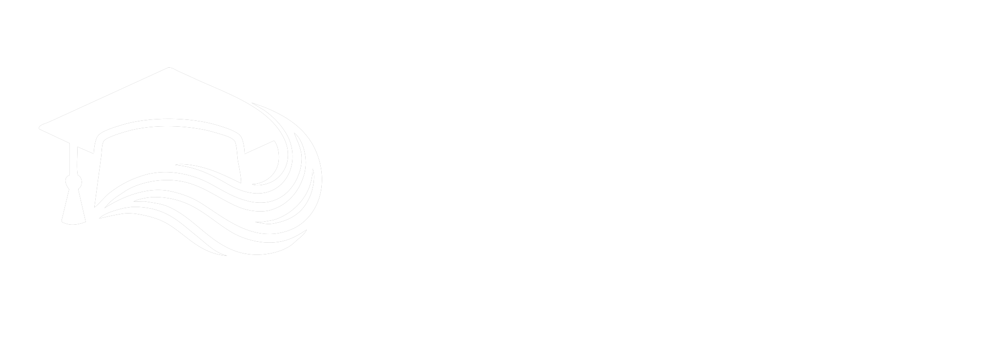
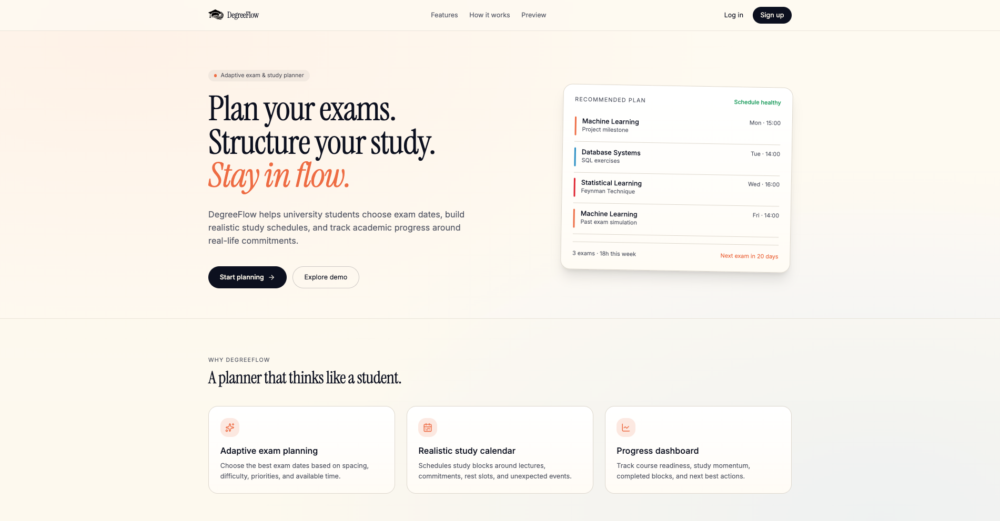
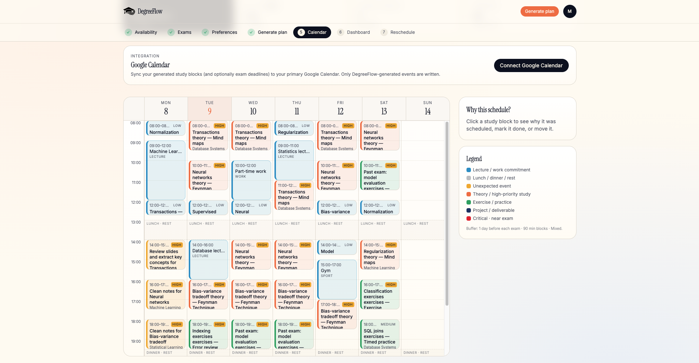
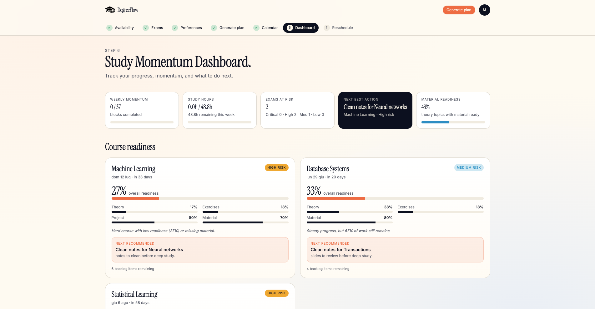

<p align="center">
  
</p>

<p align="center">
  <strong>An adaptive academic planner helping university students manage study workloads, schedule preparation, and track exam progress.</strong>
</p>

<p align="center">
  <a href="https://degreeflow.vercel.app/"><strong>Live Demo</strong></a> • 
  <a href="https://github.com/matteosgobba/degreeflow"><strong>GitHub Repository</strong></a>
</p>

<p align="center">
  
  
  
  
  
  
  
</p>

---

### Project Background

**DegreeFlow** was originally conceived and built during the PoliTO Hackathon hosted at **Politecnico di Torino**, supported by **Lovable, Red Bull, and MOREnergy Lab**. 

The core MVP was built in under 4 hours. Following the hackathon, the project was exported, configured for local development, integrated with Supabase and Google Cloud Console, tested, and deployed to Vercel.

---

### The Student Problem & The Solution

**The Problem:** University students manage exam preparation across separate tools—balancing deadlines, fixed weekly commitments, unexpected events, and study material without a clear picture of how much free time they actually have. Most calendars are static and do not adapt when schedule conflicts arise.

**The Solution:** DegreeFlow combines exam planning, study scheduling, and progress tracking in a unified workspace. By translating course backlogs into concrete tasks and matching them to actual weekly free time, it helps students answer which exams to prioritize, when to study, and how to adapt when plans change.

---

### Key Features

*   **Secure Authentication & Google Login:** Built on Supabase Auth and integrated with Google Cloud OAuth for secure user registration and calendar authorization.
*   **Weekly Availability & Commitments:** Users can define fixed constraints (lectures, work, commute, gym) so that the schedule is generated around real-world commitments.
*   **Protected Rest Slots:** Pre-defined, editable intervals (e.g., lunch and dinner) that the scheduling engine treats as strictly protected, no-study zones.
*   **Adaptive Exam Planning:** Add courses with multiple potential exam dates, difficulty levels, priorities, ECTS weights, and grade targets.
*   **Course Study Backlogs:** Subdivide courses into actionable items: Theory Topics, Exercise Categories, Project Tasks, and Materials.
*   **Constraint-Aware Scheduling Engine:** A transparent, rule-based heuristic model that computes free slots and schedules study tasks based on urgency, difficulty, exam formats (written vs. oral), and study preferences.
*   **Smart Reschedule Assistant:** A natural-language parser that processes unexpected events (e.g., *"I have a meeting tomorrow from 10:00 to 12:00"*), updates blocked slots, and shifts impacted study blocks.
*   **Study Momentum Dashboard:** Computes quantitative metrics such as overall course readiness percentages, weekly momentum, and risk levels derived from actual backlog progress.
*   **Google Calendar Sync:** Export study sessions directly to Google Calendar.
*   **Responsive UI:** Designed to work cleanly across desktop and mobile devices.

---

### Screenshots

#### Landing Page
<p align="center">
  
</p>

#### Weekly Planner & Calendar
<p align="center">
  
</p>

#### Study Momentum Dashboard
<p align="center">
  
</p>

---

### Tech Stack

*   **Frontend Framework:** React with TypeScript, using TanStack Start for routing and framework structure.
*   **Styling:** Tailwind CSS for a clean, accessible interface.
*   **Backend & Database:** Supabase for authentication, user sessions, and relational database storage.
*   **Integrations:** Google Cloud Console for OAuth and the Google Calendar API.
*   **Infrastructure:** Hosted and deployed on Vercel.

---

### Local Development

To run the project locally, follow these steps:

1. Clone the repository:
   ```bash
   git clone https://github.com/matteosgobba/degreeflow.git
   cd degreeflow
   ```

2. Install the dependencies:
   ```bash
   npm install
   ```

3. Start the local development server:
   ```bash
   npm run dev
   ```

4. Build the application for production:
   ```bash
   npm run build
   ```

---

### Environment Variables

To run the application with full functionality, create a `.env.local` file in the root of the project. **Never commit `.env.local` or any real secrets to public repositories.**

Use the following template:

```env
# Supabase Configuration
VITE_SUPABASE_URL=your_supabase_project_url
VITE_SUPABASE_PUBLISHABLE_KEY=your_supabase_anon_key
SUPABASE_URL=your_supabase_project_url
SUPABASE_PUBLISHABLE_KEY=your_supabase_anon_key
SUPABASE_SERVICE_ROLE_KEY=your_supabase_service_role_key

# Google OAuth Configuration
GOOGLE_CLIENT_ID=your_google_client_id.apps.googleusercontent.com
GOOGLE_CLIENT_SECRET=your_google_client_secret

# Application URL
APP_BASE_URL=http://localhost:5173
```

---

### Deployment

DegreeFlow is configured for deployment on **Vercel**. 

*   **Redirect URIs:** Ensure that the Google Cloud Console Authorized redirect URIs and the Supabase Authentication Redirect URLs are updated to match your production domain (e.g., `https://your-app-name.vercel.app/api/auth/callback`).
*   **Production Environment Variables:** Add all environment variables listed above inside the Vercel dashboard project settings.

---

### Security & Privacy Notes

*   **Environment Variable Safeguards:** No API keys, credentials, or client secrets are committed to the codebase.
*   **Data Separation:** Supabase Row-Level Security (RLS) is enabled to verify that users can only query, modify, and delete their own academic schedules and backlog items.
*   **OAuth Security:** Google Calendar authorization handles credential flows securely using server-side token exchanges, keeping refresh tokens safe.
*   **Data Minimization:** No unnecessary personal identifying data is collected. The system operates strictly on the academic metadata provided by the student to compute planning recommendations.

---

### Credits

Built with care by the **DegreeFlow Team** during and after the PoliTO Hackathon.
